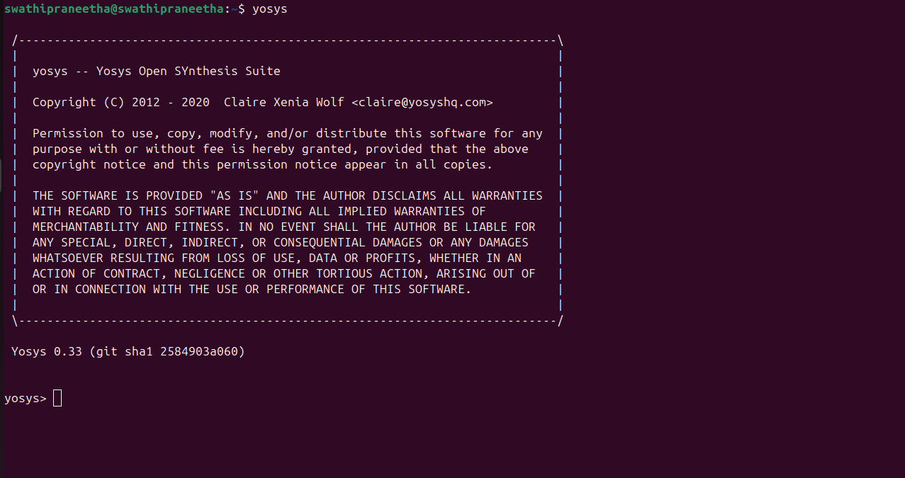
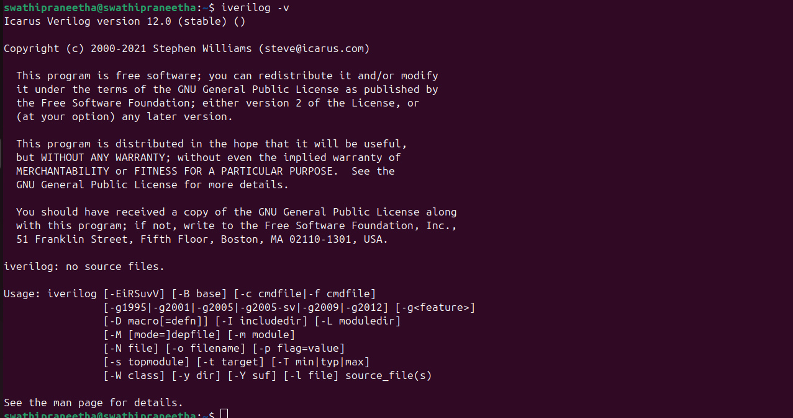
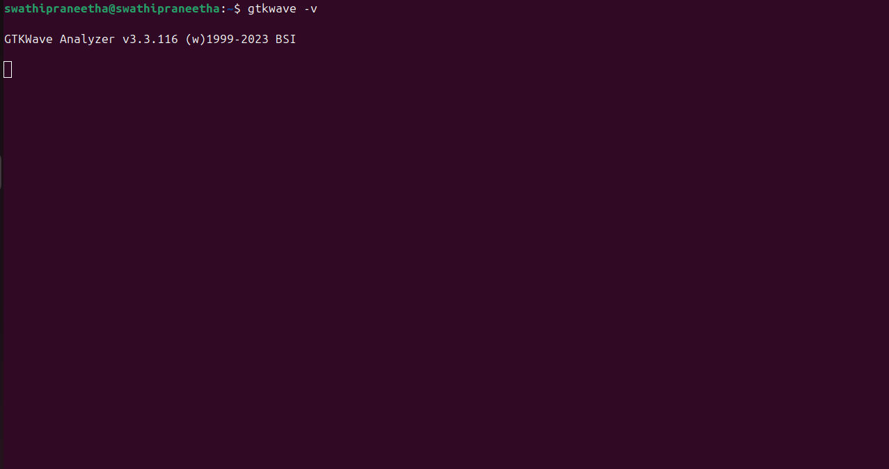

# Week 0 – System & Tool Setup ⚙️

This week focuses on setting up the environment required for the **SoC Tapeout Program (VSD)**.  
The tools installed here will be used throughout the program for RTL design, simulation, synthesis, and visualization.

---

## 🖥️ System Check
Before installation, ensure your system meets the following requirements:

- **6 GB RAM**  
- **50 GB HDD**  
- **Ubuntu 20.04+**  
- **4 vCPU**

> ⚠️ Recommended: Use **Ubuntu 20.04 or above** for best compatibility with open-source EDA tools.


## 🔧 Tool Installation

### 1. Yosys – Open Source Synthesis Tool
Yosys is used for **logic synthesis**, converting RTL (Verilog) into gate-level netlists.

**Steps to Install:**
```bash
$ sudo apt-get update
$ git clone https://github.com/YosysHQ/yosys.git
$ cd yosys
$ sudo apt install make   # If make is not installed, install it
$ sudo apt-get install build-essential clang bison flex \
 libreadline-dev gawk tcl-dev libffi-dev git \
 graphviz xdot pkg-config python3 libboost-system-dev \
 libboost-python-dev libboost-filesystem-dev zlib1g-dev
$ make config-gcc
$ make
$ sudo make install
```


### 2. Icarus Verilog (iverilog) – Verilog Simulator

Icarus Verilog is used to compile and simulate Verilog code.

**Steps to Install:**
```bash
$ sudo apt-get update
$ sudo apt-get install iverilog
```


### 3. GTKWave – Waveform Viewer

GTKWave is used to visualize simulation results in .vcd (Value Change Dump) format.
```bash
$ sudo apt-get update
$ sudo apt install gtkwave
```


